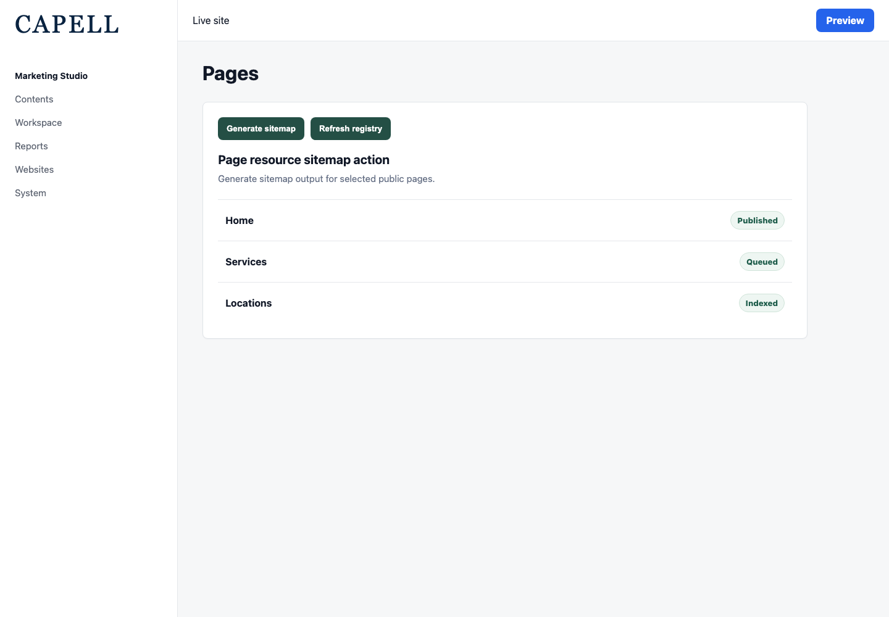
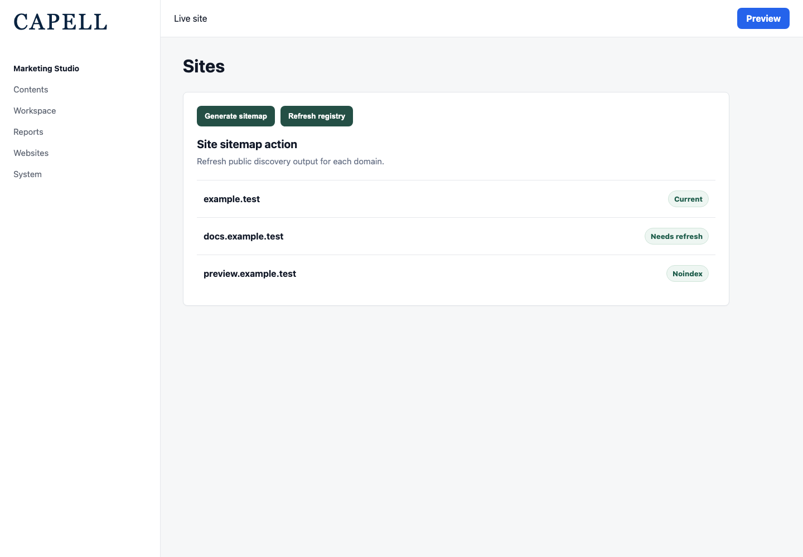
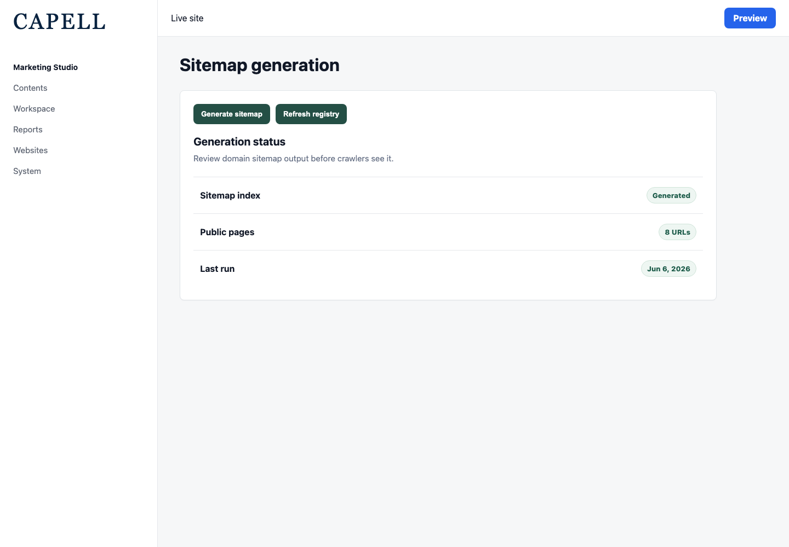
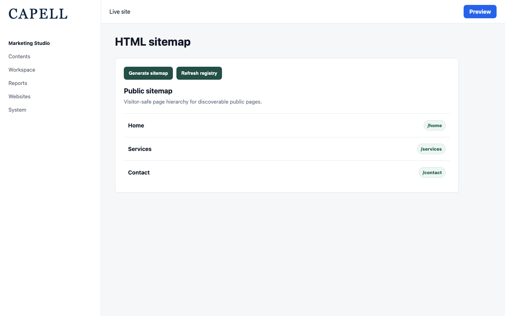
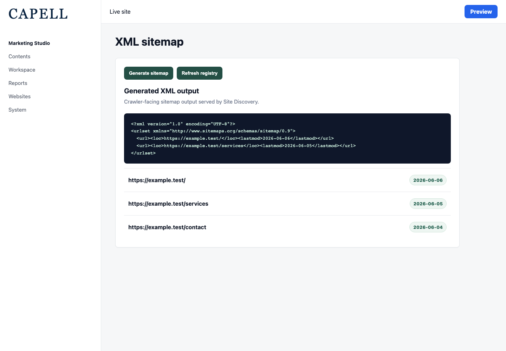
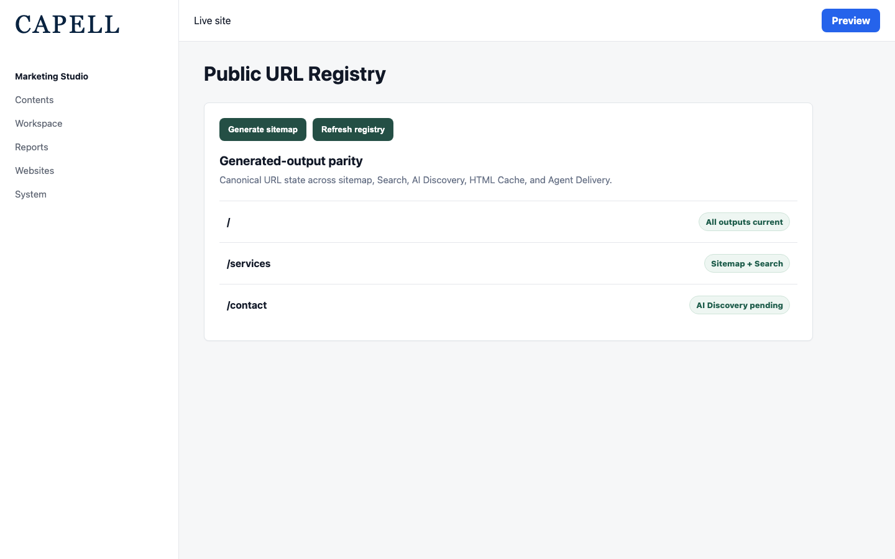
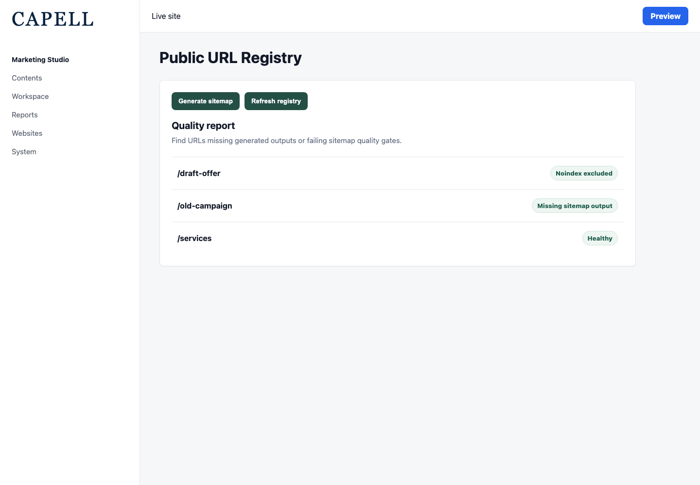

# Site Discovery

<!-- prettier-ignore-start -->

## What This Plugin Adds

Site Discovery is an **Available**, **No schema impact** Capell package in the **Capell Search & SEO** product group. It ships as `capell-app/site-discovery` and extends these surfaces: admin, frontend, console.

Make every published Capell page discoverable with automatic XML sitemaps, an HTML sitemap, and the canonical public-URL registry that powers the Search & SEO bundle.

After install, admins get package-owned management surfaces and public users may see package-owned frontend output or routes.

Status details:

- Status: Available
- Tier: premium
- Bundle: search-seo
- Composer package: `capell-app/site-discovery`
- Namespace: `Capell\SiteDiscovery`
- Theme key: not applicable

## Why It Matters

**For developers:** The package gives developers package-owned service providers, Actions, Data objects, Laravel routes, Filament classes, and Blade views instead of pushing this behaviour into core or application code.

**For teams:** Make every published Capell page discoverable - automatic XML sitemaps with index sharding, an HTML sitemap, and the canonical public-URL registry that powers the whole Search & SEO bundle.

## Screens And Workflow

Screenshot contract: `screenshots.json`.

- Page resource sitemap action (admin, required).
- Site resource sitemap action (admin, required).
- Sitemap generation tool (admin, required).
- Public HTML sitemap page (frontend, required).
- Generated XML sitemap output (frontend, required).
- Public URL Registry parity page (admin, required).
- Public URL Registry quality report (admin, required).

## Screenshot Evidence

These captures are the package-owned visual contract for the admin pages, public pages, actions, workflows, and feature surfaces described above. Keep this section aligned with `docs/screenshots.json` whenever the package surface changes.

### Page resource sitemap action

- Surface: admin · Target: PageResource.
- Documents: An editor uses the package-added sitemap action on the core Pages resource.
- Capture notes: Capture the package-added Sitemap header action on the core Pages resource.

### Site resource sitemap action

- Surface: admin · Target: SiteResource.
- Documents: An editor uses the package-added sitemap action on the core Sites resource.
- Capture notes: Capture the package-added Sitemap header or row action on the core Sites resource.

### Sitemap generation tool

- Surface: admin · Target: SitemapTool.
- Documents: An administrator generates or reviews sitemap output after demo pages are seeded.
- Capture notes: Capture the Livewire sitemap generation tool after demo pages are seeded.

### Public HTML sitemap page

- Surface: frontend · Target: /sitemap.
- Documents: A visitor opens the public HTML sitemap and sees only discoverable public pages.
- Capture notes: Capture public sitemap output with only discoverable public pages visible.

### Generated XML sitemap output

- Surface: frontend · Target: /sitemap-xml.
- Documents: A crawler or operator reviews generated XML sitemap output after running sitemap generation.
- Capture notes: Run capell:xml-sitemap in the host app before capture. The endpoint serves the generated domain XML file.

### Public URL Registry parity page

- Surface: admin · Target: PublicUrlRegistryPage.
- Documents: An administrator audits generated-output parity for public URLs across installed packages.
- Capture notes: Capture registry rows with source package, canonical URL, sitemap, AI Discovery, Search, HTML Cache, and Agent Delivery statuses visible.

### Public URL Registry quality report

- Surface: admin · Target: PublicUrlRegistryPage.
- Documents: An administrator filters the registry to find URLs missing generated outputs or failing sitemap quality checks.
- Capture notes: Capture the registry page with missing output or quality errors visible after seeding at least one missing downstream output.

## Technical Shape

- Service providers: `Capell\SiteDiscovery\Providers\SiteDiscoveryServiceProvider`.
- Config files: `packages/site-discovery/config/capell-site-discovery.php`.
- Filament classes: `SitemapResourceHeaderActionExtender`, `SitemapSiteHeaderActionExtender`, `SitemapSiteRecordActionExtender`, `PublicUrlRegistryPage`.
- Livewire components: `Sitemap`, `SitemapTool`.
- Route files: `packages/site-discovery/routes/web.php`.
- Listeners: `RegenerateSitemapsOnPageDeleted`, `RegenerateSitemapsOnPageSaved`, `RegenerateSitemapsOnSiteCreated`.
- Actions: `BuildGeneratedOutputParityReportAction`, `BuildPublicSitemapTreeAction`, `BuildPublicUrlRegistryAction`, `BuildSitemapXmlResponseAction`, `DiscoverPublicDiscoveryOutputsAction`, `DiscoverPublicPagesAction`, `DiscoverPublicUrlsAction`, `GenerateSitemapAction`, `NotifyPageUrlChangesAction`, `NotifyPublicUrlChangesAction`, `RedactIndexNowNotificationErrorMessageAction`, `RequestSiteSitemapRegenerationAction`, `and 1 more`.
- Data objects: `DiscoverablePageData`, `DiscoverableUrlData`, `DiscoveryOutputData`, `GeneratedOutputParityReportData`, `GeneratedOutputParityRowData`, `PublicUrlData`, `PublicUrlRegistryEntryData`, `SiteMapData`, `SitemapAlternateData`, `SitemapImageData`, `SitemapNewsData`, `SitemapPageData`, `and 5 more`.
- Jobs: `RegenerateSiteSitemapIncrementallyJob`.
- Command signatures: `capell:xml-sitemap`.
- Console command classes: `XmlSitemapCommand`.
- Manifest contributions: `admin-page: Capell\SiteDiscovery\Manifest\PublicUrlRegistryPageContribution`, `route: Capell\SiteDiscovery\Manifest\SiteDiscoveryFrontendRoutesContribution`, `scheduled-job: Capell\SiteDiscovery\Manifest\SiteDiscoveryIncrementalSitemapScheduleContribution`.
- Health checks: `Capell\SiteDiscovery\Health\SiteDiscoveryHealthCheck`.
- Blade views: `packages/site-discovery/resources/views/components/pages/sitemap.blade.php`, `packages/site-discovery/resources/views/components/pages/sitemap/page.blade.php`, `packages/site-discovery/resources/views/filament/pages/public-url-registry.blade.php`, `packages/site-discovery/resources/views/livewire/page/sitemap.blade.php`, `packages/site-discovery/resources/views/livewire/tools/sitemap-tool.blade.php`, `packages/site-discovery/resources/views/sitemap/sitemap-page.blade.php`.
- Cache tags: `site-discovery`.

## Data Model

This package has no schema impact. It does not declare package-owned migrations or required tables.

Docs gap: document extension points here if the package delegates persistence to a host package.

## Install Impact

- Admin navigation: adds package-owned Filament classes when registered.
- Permissions: `View:PublicUrlRegistryPage`.
- Public routes: route files exist and must be reviewed before public enablement.
- Database changes: no package migrations declared.
- Settings: no package settings declared.
- Queues or schedules: optional `capell:xml-sitemap --incremental` scheduler is disabled by default and controlled by `capell-site-discovery.incremental_sitemap_schedule`.
- Cache tags: `site-discovery`.
- Commands: `capell:xml-sitemap`.

## Common Pitfalls

- Review route middleware, throttling, signed URLs, and public-output safety before exposing routes.
- Keep public Blade and cached HTML free of authoring markers, model IDs, permissions, signed editor URLs, and lazy database queries.
- Run package commands from the host app; in this repository use `vendor/bin/pest` for package tests.
- Keep `composer.json`, `composer.local.json`, `capell.json`, docs, screenshots, and tests aligned when the package surface changes.

## Troubleshooting

| Symptom | Likely cause | Check | Fix |
| --- | --- | --- | --- |
| Package surface is missing after install | Provider or manifest is not loaded | Confirm `capell.json`, package `composer.json`, and provider registration | Reinstall the package, refresh Composer autoload, and clear host caches |
| Route returns unexpected output | Route cache, middleware, or signed URL setup does not match the package route file | Check the route files listed in `Technical Shape` | Clear route cache and verify middleware before exposing public routes |
| Background work does not run | Queue worker or scheduled command is not active | Check package jobs, commands, and host scheduler configuration | Start the queue or scheduler, then run the focused command or package test |
| Public output leaks unexpected state | Render data, cache variation, or authoring boundary has regressed | Check public Blade, cache tags, and public-output safety tests | Move data loading out of Blade and rerun the package public-output tests |

## Quick Start

1. Install the package: `composer require capell-app/site-discovery`.
2. Run the required setup: no package migrations are declared; clear cached config and routes if the host app uses caches.
3. Open the related Capell admin surface and verify Site Discovery appears.

## Next Steps

- [Package docs index](README.md)
- [Screenshot contract](screenshots.json)
- [Marketplace assets](assets/marketplace/)
- [Capell content language plan](../../../docs/CONTENT_LANGUAGE_PLAN.md)
- [Capell documentation design system](../../../docs/DESIGN_SYSTEM.md)
- [Capell and package ERD notes](../../../docs/erd/capell-and-package-erds.md)
- Related packages: [Agent Delivery](../../agent-delivery/README.md), [Search](../../search/README.md), [Seo Suite](../../seo-suite/README.md), [Url Manager](../../url-manager/README.md).
- Focused tests: `vendor/bin/pest packages/site-discovery/tests --configuration=phpunit.xml`.

<!-- prettier-ignore-end -->
